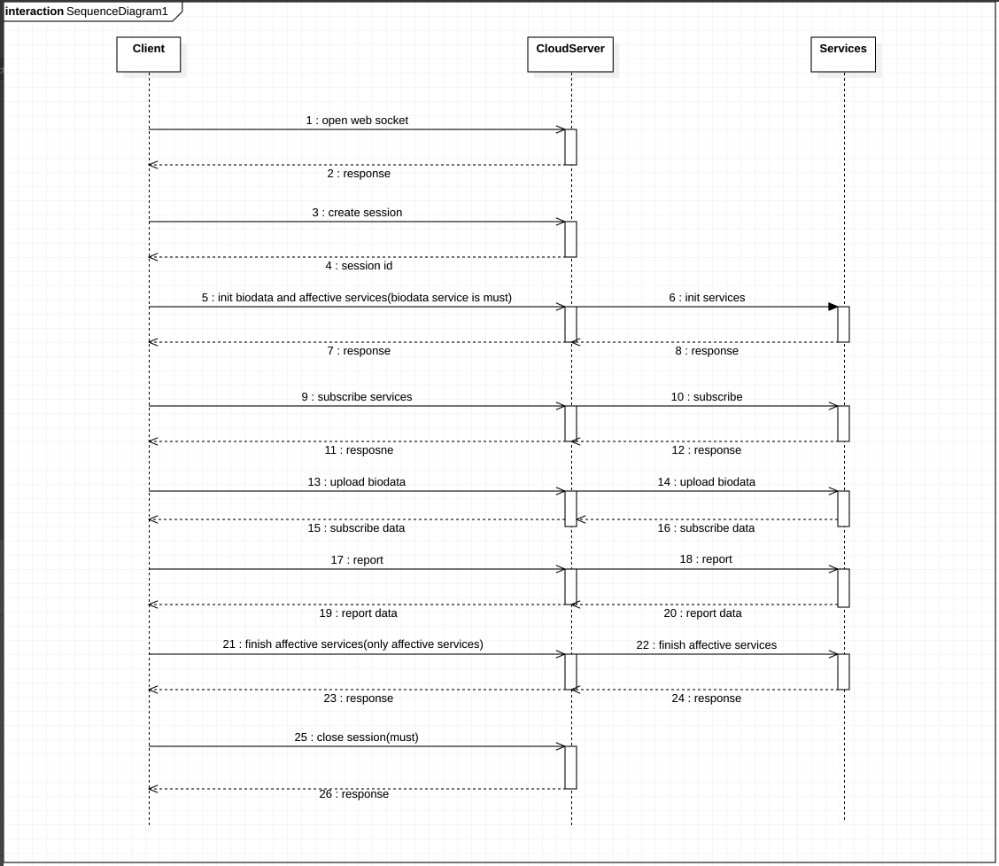

# Enter-AffectiveCloud-Andriod-SDK [](https://bintray.com/hzentertech/maven/affectivecloud/1.0.3/link)

<!-- TOC -->

- [简介](#简介)
- [集成](#集成)
    - [Gradle 自动集成](#gradle-自动集成)
    - [权限申请](#权限申请)
- [快速接入](#快速接入)
    - [1.初始化](#1初始化)
    - [2.添加实时数据监听](#2添加实时数据监听)
    - [3.上传数据](#3上传数据)
    - [4.获取报表](#4获取报表)
    - [5.资源释放](#5资源释放)
- [详细API功能说明](#详细api功能说明)
    - [会话](#会话)
        - [SDK 初始化及情感云连接](#sdk-初始化及情感云连接)
        - [是否已连接情感云](#是否已连接情感云)
        - [建立会话](#建立会话)
        - [会话是否已建立](#会话是否已建立)
        - [Restore会话](#restore会话)
    - [初始化服务](#初始化服务)
        - [初始化基础服务](#初始化基础服务)
        - [初始化情感服务](#初始化情感服务)
    - [发送数据](#发送数据)
        - [发送脑波数据](#发送脑波数据)
        - [发送心率数据](#发送心率数据)
    - [接受订阅数据](#接受订阅数据)
        - [订阅基础数据](#订阅基础数据)
        - [订阅情感数据](#订阅情感数据)
    - [取消订阅](#取消订阅)
        - [取消订阅基础数据](#取消订阅基础数据)
        - [取消订阅情感数据](#取消订阅情感数据)
    - [生成报表](#生成报表)
        - [生成基础数据报表](#生成基础数据报表)
        - [生成情感数据报表](#生成情感数据报表)
    - [结束情感服务](#结束情感服务)
    - [关闭情感云](#关闭情感云)

<!-- /TOC -->

# 简介

回车情感云可以根据用户的脑波数据和心率数据来进行高级情绪情感数据分析的一个云算法平台，同时能给出包括：放松度、注意力、愉悦值，压力值、激动度（内测）在内的多种情绪情感值。详情请查看[官网](https://www.entertech.cn)。

在开始开发前，请先查看回车情感云的[开发文档](https://docs.affectivecloud.com)，了解情感云平台的架构和所能提供的服务具体说明，确定好你的应用中所需要的服务。你还需要联系管理员注册好测试应用，然后再进行开发。

为了方便你进行 Android 平台的快速开发，我们提供了情感云快速开发 SDK，通过本 SDK 你可以快速地将情感云的能力集成到你的 app 中。

# 集成

### Gradle 自动集成
在module的build.gradle文件下添加以下依赖
```groovy
implementation 'cn.entertech:affectivecloud:1.0.3'
implementation 'com.google.code.gson:gson:2.8.5'
implementation "org.java-websocket:Java-WebSocket:1.4.0"
```
在项目根目录的build.gradle文件下添加以下依赖地址
```groovy
allprojects {
    repositories {
        maven {
            url "https://dl.bintray.com/hzentertech/maven"
        }
    }
}
```
### 权限申请

```xml
<uses-permission android:name="android.permission.INTERNET"/>
<uses-permission android:name="android.permission.ACCESS_NETWORK_STATE"/>
```

# 快速接入

SDK提供了快速接入情感云的管理类`EnterAffectiveCloudManager`，使用该类只需要几步就可以完成客户端与情感云平台的数据交互。

##  1.初始化

```kotlin
//基础服务
var availableBioServices = listOf(Service.EEG, Service.HR)
//情感云服务(需向官方申请)
var availableAffectiveServices = listOf(Service.ATTENTION, Service.PRESSURE, Service.AROUSAL, Service.SLEEP)
//基础服务订阅参数
var biodataSubscribeParams = BiodataSubscribeParams.Builder()
            .requestAllEEGData()//订阅所有eeg数据
            .requestAllHrData()//订阅所有心率相关数据
            .build()
//情感服务订阅参数
var affectiveSubscribeParams = AffectiveSubscribeParams.Builder()
            .requestAllSleepData()//订阅所有sleep服务数据
            .requestAttention()//订阅attention数据
            .requestRelaxation()//订阅relaxation数据
            .requestPressure()//订阅pressure数据
            .requestPleasure()//订阅pleasure数据
            .build()
//配置项
var enterAffectiveCloudConfig = EnterAffectiveCloudConfig.Builder(APP_KEY, APP_SECRET, USER_ID)
            .url(websocketAddress)//配置websocket地址
            .timeout(10000)//配置websocket连接超时时间 单位：ms
            .availableBiodataServices(availableBioServices)//可用的基础服务
            .availableAffectiveServices(availableAffectiveServices)//可用的情感服务
            .biodataSubscribeParams(biodataSubscribeParams!!)//基础服务订阅参数
            .affectiveSubscribeParams(affectiveSubscribeParams!!)//情感服务订阅参数
            .build()
//创建管理类
var enterAffectiveCloudManager = EnterAffectiveCloudManager(enterAffectiveCloudConfig)
//初始化SDK
enterAffectiveCloudManager?.init(object : Callback {
            override fun onError(error: Error?) {
                messageReceiveFragment.appendMessageToScreen("初始化失败：${error.toString()}")
            }
            override fun onSuccess() {
                messageReceiveFragment.appendMessageToScreen("初始化成功")
            }
        })
```

**参数说明**

|参数|类型|说明|
|:--:|:--:|:--:|
| websocketAddress | String | 情感云服务器链接，详见[链接](https://docs.affectivecloud.com/🎙接口协议/1.%20综述.html#正式) |

|参数|类型|说明|
|:--:|:--:|:--:|
| APP_KEY | String | 由我们后台生成的：App Key |
| APP_SECRET | String | 由我们后台生成的：App Secret|
| USER_ID | String | 你 app 当前用户的 id，如手机号、id 号，昵称等，需要保证唯一性。详见[userID](https://docs.affectivecloud.com/🎙接口协议/3.%20会话协议.html#userID) |

## 2.添加实时数据监听

注意如果要想实时返回数据，需要在上面步骤中配置订阅相应数据字段，否则监听将无数据返回。

```kotlin
enterAffectiveCloudManager!!.addBiodataRealtimeListener {
            messageReceiveFragment.appendMessageToScreen("基础服务实时数据：${it.toString()}")
        }
enterAffectiveCloudManager!!.addAffectiveDataRealtimeListener {
            messageReceiveFragment.appendMessageToScreen("情感服务实时数据：${it.toString()}")
        }
```

## 3.上传数据

**上传脑波数据**

```kotlin
enterAffectiveCloudManager?.appendEEGData(bytes)
```

**上传心率数据**

```kotlin
enterAffectiveCloudManager?.appendHeartRateData(heartRate)
```

> 注意：上面数据都直接由硬件返回，硬件有数据返回就调用相应的方法，传入数据即可，无需做其他处理。

## 4.获取报表

相应返回的 report 字段，由之前配置决定。具体字段的详细描述见[生物数据基础报表参数](https://docs.affectivecloud.com/🎙接口协议/4.%20生物数据基础分析服务协议.html#biodata-report)和[情感计算报表参数](https://docs.affectivecloud.com/🎙接口协议/5.%20情感计算服务协议.html#affective-report)。

```kotlin
enterAffectiveCloudManager?.getBiodataReport(object : Callback2<HashMap<Any, Any?>> {
            override fun onSuccess(t: HashMap<Any, Any?>?) {
                messageReceiveFragment.appendMessageToScreen("基础报表：${t.toString()}")
            }
            override fun onError(error: Error?) {
                messageReceiveFragment.appendMessageToScreen("基础报表出错：${error.toString()}")
            }
        })
enterAffectiveCloudManager?.getAffectiveDataReport(object : Callback2<HashMap<Any, Any?>> {
            override fun onSuccess(t: HashMap<Any, Any?>?) {
                messageReceiveFragment.appendMessageToScreen("情感报表：${t.toString()}")
            }
            override fun onError(error: Error?) {
                messageReceiveFragment.appendMessageToScreen("情感报表出错：${error.toString()}")
            }
        })
```

## 5.资源释放

注意，每次使用完情感云服务都需调用如下`release`方法来释放资源，否则会面临持续扣费的风险

```kotlin
enterAffectiveCloudManager?.release(object : Callback {
            override fun onSuccess() {
                messageReceiveFragment.appendMessageToScreen("情感云已成功断开！")
            }
            override fun onError(error: Error?) {
                messageReceiveFragment.appendMessageToScreen("情感云断开失败：${error}")
            }
        })
```


# 详细API功能说明

如果你需要根据不同场景灵活使用情感云服务，可以使用`EnterAffectiveCloudApi`来调用相应API，该类封装了所有情感云服务对外的接口。各个API调用的相互顺序可以参考以下时序图。



## 会话
### SDK 初始化及情感云连接

```kotlin
var appKey = "YOUR_APP_KEY"
var appSecret = "YOUR_APP_SECRET"
var websocketAddress = "AFFECTIVE_CLOUD_WEBSOCKET_ADDRESS"
var userID = "YOUR_APP_USER_ID"
var enterAffectiveCloudApi = EnterAffectiveCloudApiFactory.createApi(websocketAddress,appKey,appSecret,userID)
enterAffectiveCloudApi.openWebSocket(fun(){
    Logger.d("情感云连接成功...")
},fun(error:String){
    Logger.d("情感云连接失败：$error")
})
```

### 是否已连接情感云

```Kotlin
var isWebSocketOpen = enterAffectiveCloudApi.isWebSocketOpen()
Logger.d("情感云是否已连接："+isWebSocketOpen)
```

### 建立会话

```kotlin
enterAffectiveCloudApi.createSession(fun(sessionId:String){
    //成功回调
},fun(error:Error)){
    //失败回调
}
```

### 会话是否已建立

```kotlin
var isSessionCreate = enterAffectiveCloudApi.isSessionCreate()
if(isSessinoCreate){
    var sessionId = enterAffectiveCloudApi.getSessionId()
    Logger.d("当前会话id为："+ sessionId)
}
```

### Restore会话

```kotlin
enterAffectiveCloudApi.restoreSession(fun(){
    //restore成功回调
},fun(error:Error)){
    //restore失败回调
}
```

## 初始化服务

### 初始化基础服务

```kotlin
enterAffectiveCloudApi.initBiodataServices(serviceList,fun(){
    //init成功回调
},fun(error:String){
    //init失败回调
})
```

|名称|说明|
|:--:|:--:|
| EEG | 脑波数据 |
| HeartRate | 心率数据 |

### 初始化情感服务

```kotlin
enterAffectiveCloudApi.initAffectiveDataServices(serviceList,fun(){
    //init成功回调
},fun(error:String){
    //init失败回调
})
```

可使用的服务如下，具体参见[这里](https://docs.affectivecloud.com/🎙接口协议/5.%20情感计算服务协议.html#affective-start)：

|名称|说明|
|:--:|:--:|
| attention | 专注度服务 （依赖脑波数据）|
| relaxation | 放松度服务 （依赖脑波数据）|
| pleasure | 愉悦度服务 （依赖脑波数据）|
| pressure | 压力水平服务 （依赖心率数据）|
| arousal | 激活度服务 （依赖心率数据）|
| sleep | 睡眠检测和判断服务 |


## 发送数据

### 发送脑波数据

```kotlin
enterAffectiveCloudApi.appendEEGData(EEGData)
```

### 发送心率数据

```kotlin
enterAffectiveCloudApi.appendHeartRateData(heartRateData)
```

## 接受订阅数据

### 订阅基础数据

```kotlin
enterAffectiveCloudApi.subscribeBiodata(dataNameList,fun(data：Type){
    Logger.d("基础数据："+data)
},fun(){
     //订阅成功回调
},fun(subError:String){
    //订阅失败回调
})
```

可订阅的基础生物数据服务如下：

| biodataName | 说明 |
|:--:|:--:|
| eeg_wave_left | 脑电波：左通道脑波数据 |
| eeg_wave_right | 脑电波：右通道脑波数据 |
| eeg_alpha | 脑电波频段能量：α 波 |
| eeg_beta | 脑电波频段能量：β 波 |
| eeg_theta | 脑电波频段能量：θ 波 |
| eeg_delta | 脑电波频段能量：δ 波 |
| eeg_gamma | 脑电波频段能量：γ 波 |
| eeg_quality | 脑电波数据质量 |
| hr_value | 心率 |
| hr_variability | 心率变异性 |


### 订阅情感数据

```
enterAffectiveCloudApi.subscribeAffectiveData(dataNameList,fun(data:Type){
     Logger.d("情感数据："+data)
},fun(){
     //订阅成功回调
},fun(subError:String){
  	 //订阅失败回调
})
```

可订阅的情感分析数据服务如下，具体参见[这里](https://docs.affectivecloud.com/🎙接口协议/5.%20情感计算服务协议.html#affective-subscribe)：

| 服务类型(cloud_service) | 数据类型(data_type) | 类型 | 取值范围 | 说明 |
| :---: | :---: | :---: | :---: | :---: |
| attention | attention | float | [0, 100] | 注意力值，数值越高代表注意力越高 |
| relaxation | relaxation | float | [0, 100] | 放松度值，数值越高代表放松度越高 |
| pressure | pressure | float | [0, 100] | 压力水平值，数值越高代表压力水平越高 |
| pleasure | pleasure | float | [0, 100] | 愉悦度值，数值越高代表情绪愉悦度越高 |
| arousal | arousal | float | [0, 100] | 激活度值，数值越高代表情绪激活度越高 |
| sleep | sleep_degree | float | [0, 100] | 睡眠程度，数值越小代表睡得越深 |
| | sleep_state | int | {0, 1} | 睡眠状态，0 表示未入睡，1 表示已入睡 |


## 取消订阅

### 取消订阅基础数据

配置你要取消订阅的服务。

```kotlin
enterAffectiveCloudApi.unsubscribeBiodata(dataNameList,fun(){
     //取消订阅成功回调
},fun(subError:String){
    //取消订阅失败回调
})
```

### 取消订阅情感数据

配置你要取消订阅的服务。

```kotlin
enterAffectiveCloudApi.unsubscribeAffectivedata(dataNameList,fun(){
     //取消订阅成功回调
},fun(subError:String){
    //取消订阅失败回调
})
```

## 生成报表

### 生成基础数据报表

生成的基础生物数据报表的格式参数，参见[这里](https://docs.affectivecloud.com/🎙接口协议/4.%20生物数据基础分析服务协议.html#biodata-report)。

```kotlin
enterAffectiveCloudApi.getBiodataReport(dataNameList,fun(data:BiodataReport)){
     Logger.d("基础报表："+data)
}
```

### 生成情感数据报表

生成的情感数据报表的格式参数，参见[这里](https://docs.affectivecloud.com/🎙接口协议/5.%20情感计算服务协议.html#affective-report)。

```kotlin
enterAffectiveCloudApi.getAffectivedataReport(dataNameList,fun(data:AffectiveDataReport)){
     Logger.d("情感报表："+data)
}
```

## 结束情感服务

```kotlin
enterAffectiveCloudApi.finishAffectiveDataServices(fun(){
    Logger.d("已正常结束情感云服务")
},fun(error:String){
    Logger.d("结束情感云服务遇到问题：$error")
})
```

## 关闭情感云

```kotlin
enterAffectiveCloudApi.destroySessionAndCloseWebSocket()
```


