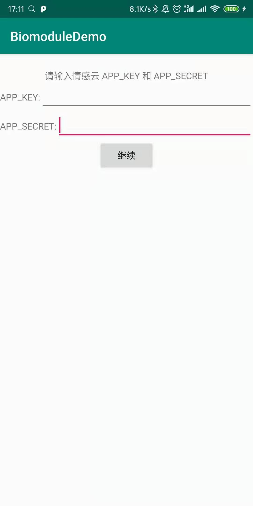
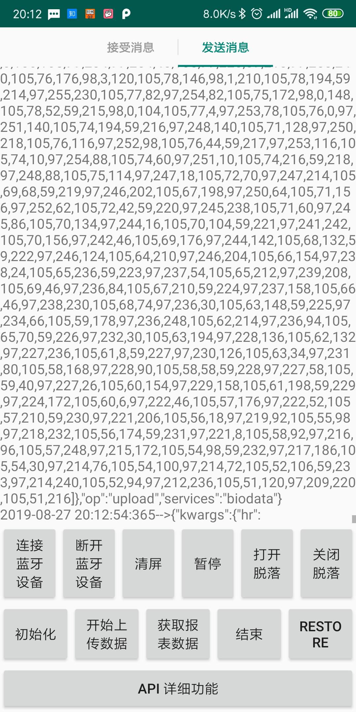

[English Readme](../demo/README_EN.md)
# 回车生物电采集模块演示 demo

## 硬件使用
关于硬件的操作，请参考[回车生物电采集模块操作说明](https://docs.affectivecloud.com/📲蓝牙采集模块/回车生物电蓝牙采集模块操作说明.html)。

硬件使用的注意事项，请参考[回车生物电采集模块使用注意事项](https://docs.affectivecloud.com/📲蓝牙采集模块/回车蓝牙生物电采集模块使用注意事项.html)。

## Demo 说明

本 demo 演示了设备连接和脑波数据的采集，将采集到的数据发送到云端，经过云端算法分析后返回分析结果的整个过程。主要包含两部分：
* 集成模块的蓝牙 SDK，完成设备连接和数据采集，具体参见此蓝牙 SDK 工程--[Enter-Biomodule-BLE-Android-SDK](https://github.com/EnterTech/Enter-Biomodule-BLE-Android-SDK)；
* 情感云SDK，将蓝牙采集到的原始数据上传至情感云，具体文档可查看[回车情感云平台 SDK(Android)](../README.md)。

## 操作
* 第一次打开demo时需输入你申请的情感云的app key 和 app secret，如果没有需向管理员申请；
* 点击`连接蓝牙设备`进行设备蓝牙连接，此时设备需处于广播状态；
* 连接设备后，点击 `初始化` 、`开始上传数据`、`获取报表数据`、`结束`等按钮进行情感云平台的快速交互；
* 如果你有一些自定义的交互场景，或者想详细了解情感云提供的接口，也可以点击`API详细功能`查看。
## 界面交互和展示

接收和发送的数据会实时显示在屏幕上，可左右滑动进行切换。

