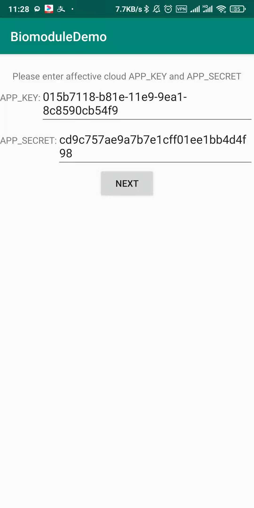
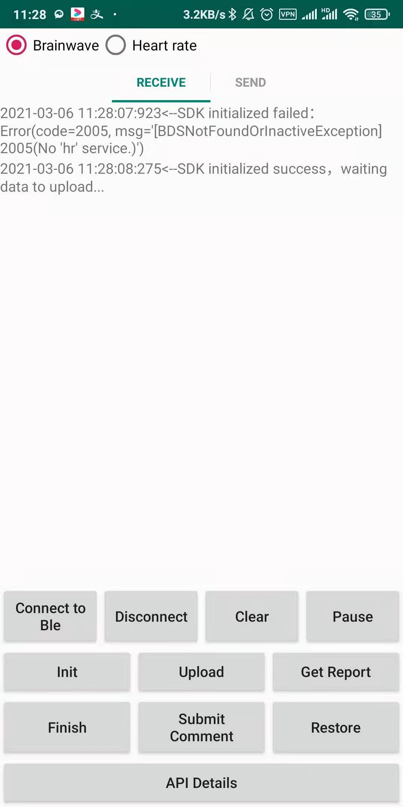
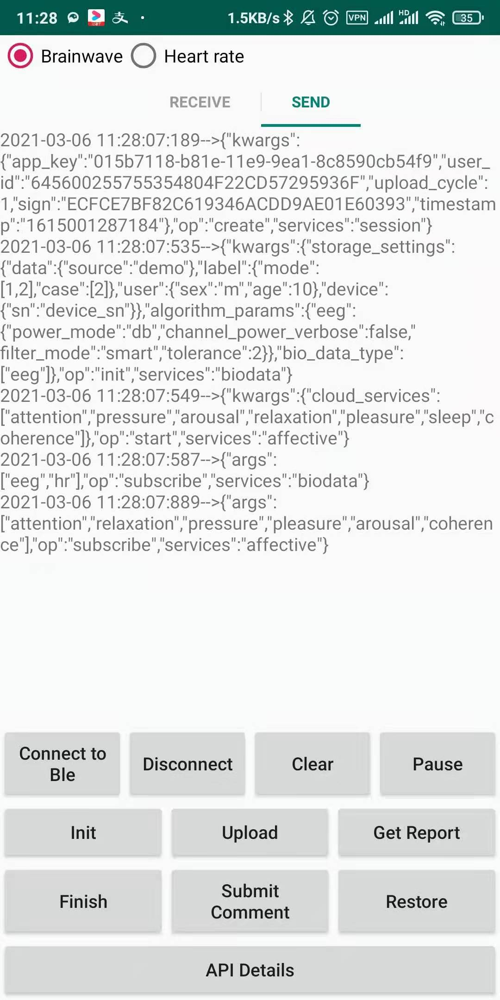

# Enter Bioelectric Acquisition Module Demo

## Hardware usage
For the operation of the hardware, please refer to [Enter Bioelectricity Acquisition Module Operation Instructions](https://docs.affectivecloud.com/📲蓝牙采集模块/回车生物电蓝牙采集模块操作说明.html)。

For the precautions for hardware use, please refer to [Enter Precautions for the Use of Bioelectric Acquisition Module](https://docs.affectivecloud.com/📲蓝牙采集模块/回车蓝牙生物电采集模块使用注意事项.html)。

## Demo Description

This demo demonstrates the entire process of device connection and brainwave data collection, sending the collected data to the cloud, and returning the analysis results after cloud algorithm analysis. It mainly consists of two parts:
* Integrate the Bluetooth SDK of the module to complete device connection and data collection, please refer to this Bluetooth SDK project for details--[Enter-Biomodule-BLE-Android-SDK](https://github.com/Entertech/Enter-Biomodule-BLE-Android-SDK/blob/master/README_EN.md)；
* Emotion Cloud SDK, upload the raw data collected by Bluetooth to Emotion Cloud, the specific documents can be viewed [Enter Affective Cloud Platform SDK (Android)](../README_EN.md)。

## Operation
* When opening the demo for the first time, you need to enter the app key and app secret of the emotional cloud you applied for, if not, you need to apply to the administrator;
* Click `Connect to Ble` to connect the device with Bluetooth, and the device needs to be in the broadcast state;
* After connecting the device, click the buttons of `Init`, `Upload`, `Get Report`, `Finish`, etc. to quickly interact with the emotional cloud platform;
* If you have some custom interaction scenarios, or want to learn more about the interfaces provided by Emotion Cloud, you can also click `API Details` to view.
## Display
The received and sent data will be displayed on the screen in real time, and you can swipe left and right to switch.

